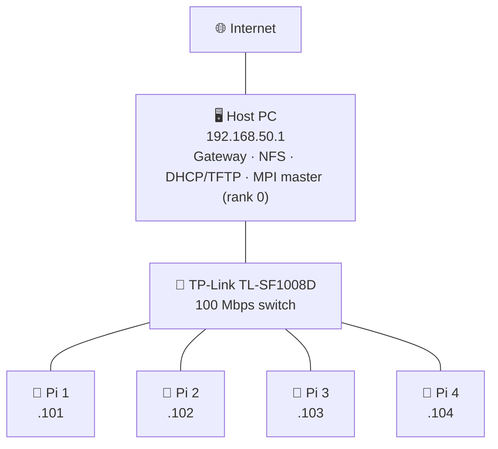
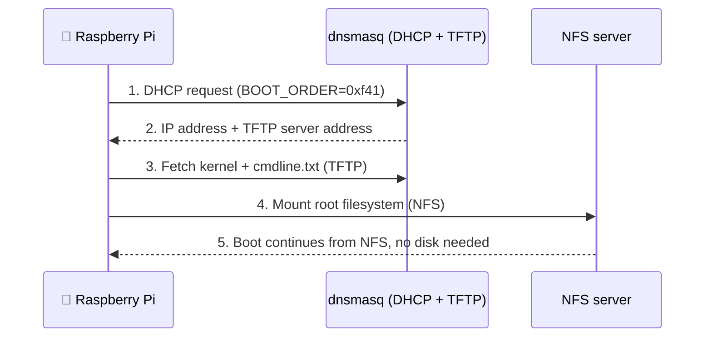
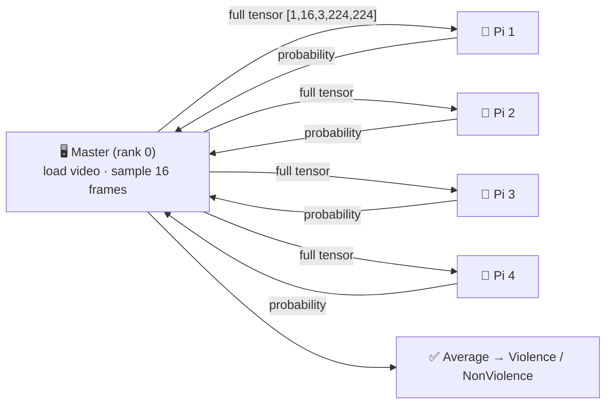

# 🖥️ Low-Cost HPC Cluster using MPI for Real-Time Violence Detection

> A diskless **Raspberry Pi 4 cluster** that runs **distributed deep-learning inference** with **OpenMPI**, plus a full performance study (Amdahl, Gustafson, Karp–Flatt) explaining *why* it behaves the way it does.

**🏫 École Supérieure en Informatique de Sidi Bel Abbès (ESI-SBA)** · Project 2CS · Option ISI · Academic year 2025–2026

---

## 📑 Table of Contents

1. [Project at a glance](#-project-at-a-glance)
2. [Cluster architecture](#-cluster-architecture)
3. [Part 1 – Building the cluster](#-part-1--building-the-cluster)
4. [Part 2 – Performance analysis](#-part-2--performance-analysis)
5. [Part 3 – Violence detection model](#-part-3--violence-detection-model)
6. [Part 4 – MPI inference on the Pis](#-part-4--mpi-inference-on-the-pis)
7. [Demo app](#-demo-app)
8. [Key lessons learned](#-key-lessons-learned)
9. [Credits](#-credits)

---

## 🎯 Project at a glance

| | |
|---|---|
| **Goal** | Build a cheap HPC cluster and use it for distributed violence detection in videos |
| **Hardware** | 1 master PC + 4 × Raspberry Pi 4 + 100 Mbps switch |
| **Software** | OpenMPI 4.1.6, PXE/NFS network boot, PyTorch (TorchScript), Streamlit |
| **Model** | R3D-18 + Transformer hybrid, **95.55 % accuracy**, 97.25 % precision |
| **Main finding** | The cluster is **communication-bound**, not compute-bound. The 100 Mbps switch is the bottleneck |

---

## 🏗️ Cluster architecture



- **Subnet:** `192.168.50.0/24` with static IPs per node
- **Master (rank 0):** gateway, NFS server, DHCP/TFTP server and MPI launcher
- **Workers (ranks 1–4):** Raspberry Pi 4 nodes booting **without any SD card**

---

## 🔧 Part 1 – Building the cluster

### 1.1 Connectivity layer

| Technology | Role in the cluster |
|---|---|
| **NAT + iptables** | The host shares its internet connection with the Pis |
| **IP forwarding** | Lets the host kernel route packets between interfaces |
| **SSH (Ed25519 keys)** | Passwordless remote access, required by MPI |
| **OpenMPI + ORTE** | Launches and manages processes on all nodes |
| **TCP BTL** | The transport MPI uses to move data between nodes |

<details>
<summary>📘 <b>Concept: why does MPI need passwordless SSH?</b></summary>

When you run `mpirun`, OpenMPI **connects to every node over SSH** and starts a small daemon (`orted`) that then launches your program. If SSH asks for a password, the launch hangs. That's why each node gets an SSH key pair and the public keys are distributed to all nodes.
</details>

**Share internet with the Pis (NAT):**

```bash
sudo sysctl -w net.ipv4.ip_forward=1
sudo iptables -t nat -A POSTROUTING -o <UPLINK_IFACE> -j MASQUERADE
sudo iptables -A FORWARD -i <CLUSTER_IFACE> -o <UPLINK_IFACE> -j ACCEPT
```

**Generate SSH keys on every node:**

```bash
for ip in 100 101 102 103 104; do
  ssh pi@192.168.50.$ip "ssh-keygen -t ed25519 -N '' -f ~/.ssh/id_ed25519"
done
```

**Fix the SSH "MITM warning" after re-imaging a node** (its host key changed):

```bash
ssh-keygen -f ~/.ssh/known_hosts -R '192.168.50.1XX'
```

**Run an MPI job across nodes:**

```bash
mpirun -np 2 \
  --host 192.168.50.1,192.168.50.101 \
  --mca plm_rsh_agent "ssh -l slave -x" \
  --mca btl_tcp_if_include 192.168.50.0/24 \
  ./hello_mpi
```

> [!TIP]
> `btl_tcp_if_include` is **required when a machine has several network interfaces**; otherwise MPI may pick the wrong one and hang.

**Receiving a message of unknown size** (`MPI_Probe` pattern):

```c
MPI_Status status;
int count;
MPI_Probe(source, tag, MPI_COMM_WORLD, &status);   // peek at the message
MPI_Get_count(&status, MPI_INT, &count);           // how many elements?
int *buffer = malloc(sizeof(int) * count);         // allocate exact size
MPI_Recv(buffer, count, MPI_INT, source, tag, MPI_COMM_WORLD, MPI_STATUS_IGNORE);
free(buffer);
```

### 1.2 Diskless network boot (PXE / NFS)

Every Pi boots **with no local storage**. Its entire root filesystem lives on the host and is served over the network. Update the *golden image* once, and every node sees the change on next boot.



| Protocol | Job | Daemon |
|---|---|---|
| **PXE** | Triggers the network boot sequence | Pi bootloader |
| **DHCP** | Gives each node its IP address | `dnsmasq` |
| **TFTP** | Delivers kernel and boot files | `dnsmasq` |
| **NFS** | Exports and mounts the root filesystem | `nfs-kernel-server` |

<details>
<summary>📘 <b>Concept: what is a "golden image"?</b></summary>

A golden image is one fully configured, reference copy of the system (here: node 1). To add a new node you **clone** it and only patch what must be unique (hostname, IP, `cmdline.txt`, `fstab`, NFS export, DHCP entry). The provisioning script automates all of this.
</details>

**Host dependencies:**

```bash
sudo apt install nfs-kernel-server dnsmasq tftpd-hpa kpartx unzip xz-utils
```

**Check that the Pi can network-boot:**

```bash
vcgencmd bootloader_config
# Required: BOOT_ORDER=0xf41
```

**Key configuration pieces:**

```bash
# /etc/exports: one export per node
/srv/nfs/slave1  192.168.50.101(rw,sync,no_subtree_check,no_root_squash)

# /etc/dnsmasq.conf
enable-tftp
tftp-root=/srv/tftpboot
pxe-service=0,"Raspberry Pi Boot"
dhcp-host=<MAC_ADDRESS>,192.168.50.101,slave1   # one line per node
```

**Provision a new node in one command:**

```bash
./provision.sh <HOSTNAME> <IP> <MAC> <SERIAL>
```

The script clones the golden image (`/srv/nfs/mypi`), sets the hostname, writes the NFS-root `cmdline.txt`, bind-mounts the boot partition into the TFTP tree, registers the node in dnsmasq, adds the NFS export, then reloads all services.

> [!NOTE]
> To enable SSH on a freshly cloned image, drop an empty file named `ssh` in its boot partition: `sudo touch /srv/nfs/slave1/boot/ssh`

---

## 📊 Part 2 – Performance analysis

### 2.1 Raw results

| Metric | Sequential (PC) | 1 Pi (MPI) | 4 Pis (MPI) |
|---|---:|---:|---:|
| Total time (s) | 1042.7 | 2354.3 | **844.1** |
| Compute (s) | 1042.7 | 2148.7 | 519.6 |
| Communication (s) | 0 | 205.7 | 324.5 |

- **Load balance is excellent:** workers finished in 495.7–519.6 s (only **2.9 %** imbalance), so the work distribution is correct.
- **Communication is near the physical limit:** 4800 MB over 100 Mbps would take 384 s in theory; we measured 324.5 s. The network is saturated.
- **1 Pi is slower than the sequential run** (2.26×) because of communication overhead alone.

### 2.2 Core metrics, explained

<details open>
<summary>📘 <b>Speedup and efficiency</b></summary>

- **Speedup:** `S(p) = T_seq / T_p`. How many times faster than the sequential run?
- **Efficiency:** `E(p) = S(p) / p`. How well are the `p` processors actually used?

| | S(p) | E(p) |
|---|---:|---:|
| 1 Pi | 0.443 | 44.3 % |
| 4 Pis | **1.235** | **30.9 %** |

Only about one third of the theoretical parallel performance is achieved.
</details>

<details>
<summary>📘 <b>Amdahl's Law: fixed problem size</b></summary>

Every program has a **serial part** `f_s` (cannot be parallelised) and a **parallel part** `f_p = 1 − f_s`.

```
S(p) = 1 / ( f_s + f_p / p )        S_max = 1 / f_s
```

For this cluster the serial fraction is dominated by communication: `f_s = 0.3845`.

- Predicted speedup with 4 nodes: **1.857×**
- Absolute ceiling with infinite nodes: **2.601×**
- Measured: **1.235×**, about 66.5 % of what Amdahl predicts. The rest is lost to latency, serialisation, synchronisation and contention.

**Takeaway:** reducing the serial fraction is far more valuable than adding nodes. Going from `f_s = 0.38` to `0.10` would lift the ceiling from 2.6× to 10×.
</details>

<details>
<summary>📘 <b>Gustafson's Law: scaled problem size</b></summary>

Amdahl asks *"how much faster can I solve the same problem?"* Gustafson asks *"how much **bigger** a problem can I solve in the same time?"*

```
S(p) = p − f_s · (p − 1)      →      S(4) ≈ 2.847
```

| | Amdahl | Gustafson |
|---|---|---|
| Problem size | Fixed | Grows with processors |
| Goal | Minimise runtime | Maximise workload size |
| Best for | Latency reduction | Large-scale HPC / simulation |

This cluster is **better at handling larger workloads than at speeding up small fixed ones**.
</details>

<details>
<summary>📘 <b>Karp–Flatt metric: the <i>experimental</i> serial fraction</b></summary>

Amdahl's `f_s` is a model parameter. Karp–Flatt computes the *effective* serial fraction directly from measurements, capturing communication, sync delays, imbalance and start-up costs:

```
e = ( 1/S(p) − 1/p ) / ( 1 − 1/p )      →      e ≈ 0.746 (74.6 %)
```

The system behaves as if **74.6 %** of the runtime were non-parallelisable, far above the theoretical 38.45 %. This confirms communication overhead is the dominant problem.
</details>

### 2.3 Theory vs. reality

| Model | Speedup at p = 4 |
|---|---:|
| Linear ideal | 4.000 |
| Gustafson | 2.847 |
| Amdahl | 1.857 |
| **Measured** | **1.235** |

The ideal runtime would be `1042.7 / 4 = 260.7 s`; the real system is **3.24× slower** than that.

### 2.4 The fix: a Gigabit switch (~$20)

The Pi 4 already has a Gigabit Ethernet port, and the Cat 6 cables can handle it. Only the **switch** limits the fabric to 1 % of the cable capability. Replacing it with a TP-Link TL-SG108 gives:

| Metric | 100 Mbps (current) | 1 Gbps (proposed) |
|---|---:|---:|
| Communication time | 324.5 s | **38.4 s** |
| Total runtime | 844.1 s | **558.0 s** |
| Speedup | 1.235 | **1.87** |
| Serial fraction f_s | 38.45 % | 6.88 % |
| Amdahl ceiling | 2.601 | **14.53** |
| Efficiency | 30.9 % | 46.7 % |

> [!IMPORTANT]
> Beyond the hardware fix, further gains need **algorithmic communication reduction**, e.g. SUMMA or Cannon's algorithm for matrix multiplication.

---

## 🧠 Part 3 – Violence detection model

### 3.1 Why it matters

Automatic violence detection supports **surveillance** (airports, streets, malls), **crime prevention / early warning**, and **content moderation**. Unlike image classification, video needs both:

- 🖼️ **Spatial features**: what appears in each frame
- ⏱️ **Temporal dynamics**: how the action evolves over time

### 3.2 Dataset

Two public Kaggle sources were merged into one balanced binary dataset.

| Source | Clips | Size |
|---|---:|---:|
| RLVS + Hockey Fight | 3 000 | 2.57 GB |
| Video Violence Detection | 4 000 | 14.65 GB |
| **Merged** | **7 000** | **17.22 GB** |

Classes: `Violence (1)` vs `NonViolence (0)`, 3 500 clips each. Corrupted videos are skipped automatically, leaving a split of **4 900 / 1 050 / 1 050** (train / val / test).

### 3.3 Preprocessing pipeline

1. **Sample exactly 16 frames** per video (`np.linspace`)
2. **Resize** to 224 × 224
3. **Normalise** with ImageNet statistics: `x̂ = (x/255 − μ) / σ`
4. **Cache** as `.pt` tensors for fast loading, batch shape `[B, 16, 3, 224, 224]`

### 3.4 Models

| | Baseline | **Final hybrid** |
|---|---|---|
| Architecture | ResNet18 / MobileNetV2 per frame + temporal average | **R3D-18 (3D CNN) + Transformer encoder** |
| Temporal modelling | Simple averaging | 2-layer, 4-head self-attention + attention pooling |
| Outputs | 1 logit | Violence logit **+ uncertainty estimate** |
| Test accuracy | ≈ 83.6 % | **95.55 %** |

<details>
<summary>📘 <b>Why a CNN + Transformer?</b></summary>

CNNs are excellent at **spatial** patterns; Transformers are excellent at modelling **relationships across time**. Combining them lets the model see *what* is in the frames and *how* the action unfolds.
</details>

**Training tricks:** focal loss + label smoothing, MixUp / temporal jitter / speed variation augmentation, cosine annealing over 30 epochs, gradient clipping, and threshold tuning (optimal ≈ **0.65**, recall kept ≥ 87 %).

### 3.5 Results (test set, 1 050 clips)

| Accuracy | Precision | Recall | F1 | ROC-AUC |
|---:|---:|---:|---:|---:|
| **95.55 %** | **97.25 %** | 93.75 % | 95.47 % | 0.9746 |

Only **14 false positives** and **33 false negatives**.

---

## 🚀 Part 4 – MPI inference on the Pis

### 4.1 Master–worker design



<details open>
<summary>📘 <b>Why does every Pi receive the <i>full</i> clip?</b></summary>

The model was trained on **16-frame sequences**. Splitting the clip into 4-frame pieces would destroy the temporal patterns it learned and give wrong predictions. So each Pi runs the complete model on the complete clip, and the master **averages the four probabilities** to reduce prediction noise.
</details>

### 4.2 Code highlights

**Frame sampling (identical to training):**

```cpp
int last = std::max(total - 1, 0);
for (int i = 0; i < NUM_FRAMES; i++)
    idxs[i] = static_cast<int>(std::round(i * last / (NUM_FRAMES - 1.0)));
```

**Master: broadcast the tensor, collect and average:**

```cpp
for (int w = 1; w <= NUM_WORKERS; w++) mpi_send_tensor(input, w);

float sum_prob = 0.0f;
for (int w = 1; w <= NUM_WORKERS; w++) {
    float prob;
    MPI_Recv(&prob, 1, MPI_FLOAT, w, TAG_RESULT_PROB, MPI_COMM_WORLD, MPI_STATUS_IGNORE);
    sum_prob += prob;
}
bool violence = (sum_prob / NUM_WORKERS) > threshold;
```

**Worker: receive, infer, reply:**

```cpp
torch::Tensor input = mpi_recv_tensor(0);
torch::NoGradGuard no_grad;
auto output = model.forward({input}).toTuple();
float logit = output->elements()[0].toTensor().item<float>();
float prob  = 1.0f / (1.0f + std::exp(-logit));      // sigmoid
MPI_Send(&prob, 1, MPI_FLOAT, 0, TAG_RESULT_PROB, MPI_COMM_WORLD);
```

> [!NOTE]
> A tensor is sent in three MPI messages: number of dimensions → shape → raw float data. The receiver can then rebuild it without knowing its size in advance.

---

## 🌐 Demo app

A **Streamlit** web app lets you:

- 📤 Upload a video (`.mp4`, `.avi`, `.mov`, …)
- 📈 See the Violence / NonViolence probabilities next to the video
- 🚨 Get a clear decision banner with the final classification

The model is also deployed on **Hugging Face Spaces** (no local install needed). To run it locally, clone the repository and place the trained `.pt` model in `/models`.

---

## 💡 Key lessons learned

1. **The network, not the CPU, was the bottleneck.** A $20 switch beats extra nodes.
2. **Adding processors has diminishing returns** when the serial fraction is high (Amdahl).
3. **Several metrics tell a fuller story.** Amdahl gives a ceiling, Gustafson shows scaled capacity, Karp–Flatt reveals the real overhead.
4. **Diskless boot + golden image** makes a cluster easy to maintain and scale.
5. **Match inference to training.** Same frame sampling, same normalisation, full 16-frame clips.
6. **Next steps:** Gigabit switch, TorchScript quantisation for on-device speed, and communication-avoiding algorithms.

---

## 👥 Credits

**Project members:** BELAID El Baraa · BOUCHEMELLA Mohamed · TOUATI Tliba Mohamed Sghir · BLIZAK Haithem · BENGHERABI Mohamed Amine

**Supervisors:** Dr Abdelkader AMRANE · Dr Abdelatif RAHMOUN

---
## 👨‍💻 My Contributions

I was mainly responsible for the distributed infrastructure and communication
layer of the cluster, as well as part of the performance analysis.

### Cluster Infrastructure & Networking

- Configured the network connectivity between the Raspberry Pi nodes and
  verified node-to-node communication before deploying MPI.
- Configured network services required for the diskless cluster architecture.
- Implemented NFS-based network filesystem access.
- Configured network booting, allowing Raspberry Pi workers to boot their
  operating system over the network without relying on local storage.
- Prepared and maintained the network configuration required for the
  master/worker architecture.

### OpenMPI Configuration

- Configured OpenMPI across the master and Raspberry Pi worker nodes.
- Ensured that the MPI environment and required configuration were consistent
  across the cluster.
- Tested communication between MPI processes before running the distributed
  workloads.

### Performance Analysis

I also participated in the experimental performance analysis of the cluster:

- Compared execution time across different execution configurations.
- Measured and analyzed the speedup obtained from parallel execution.
- Applied Amdahl's Law to estimate theoretical speedup and scalability limits.
- Applied Gustafson's Law to analyze scaled workloads.
- Used the Karp–Flatt metric to estimate the effective serial fraction.
- Analyzed communication overhead and identified the network as a major
  scalability bottleneck.

The measured 4-node configuration achieved a speedup of approximately `1.235×`,
while the analysis showed that communication overhead and the 100 Mbps network
fabric significantly limited scalability.


⭐ If you found this project useful or educational, feel free to star the repository!
